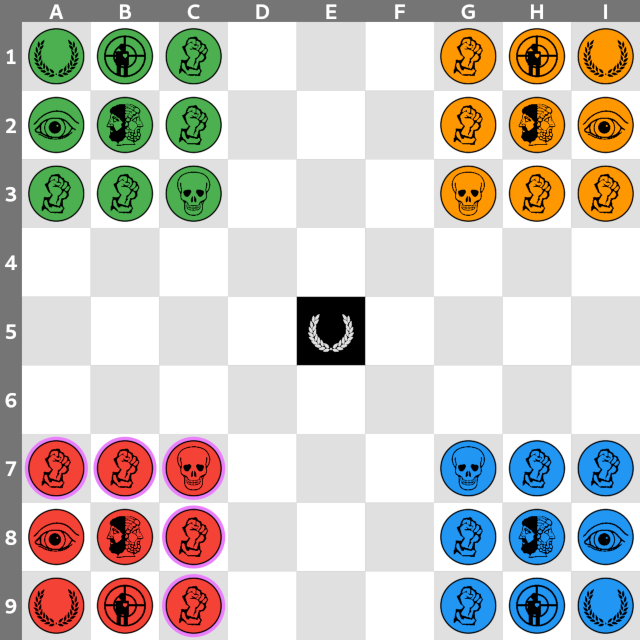
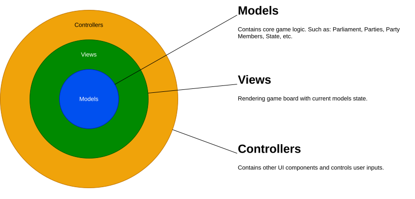

# Djambi

powered by

**Djambi** is a chess variant for four players designed by *Jean Anesto* in 1975.
As in chess, pieces represent real-life political roles, but in contrast,
they are inspired by modern societies instead of medieval ones.
The game pieces symbolize common sins in modern politics.
For more details, check the [game page](https://en.wikipedia.org/wiki/Djambi) on Wikipedia.

AVAILABLE ON

## Known Issues

* When a Chief leave the Maze, its team still get extra turn.
* When no player can win, nothing is happen.

## Roadmap

- [x] Simple AI algorithm.
- [x] Undo last play is missing.
- [x] Show next player.
- [x] Complete GUI with Home page and Settings page.
- [ ] Detailed description about the game and its rules.
- [x] Application icon.
- [ ] Improve UI graphics.
- [ ] Save game state.
- [ ] Add two players variation.
- [ ] Improve AI algorithm.

## Architecture

The core code of the project lays inside [flutter/lib](flutter/lib) directory and it is structured as follows:

## License

This project is license under a [GPL-3.0](https://www.gnu.org/licenses/gpl-3.0.html) license.

## Disclaimer & Credits

* This game is a **fan-made**, **non-commercial** recreation of Djambi,
  a public-domain board game designed by *Jean Anesto* in 1975.
* This project is **not officially affiliated** with *Jean Anesto*, his heirs,
  or any company that may have published Djambi historically.
* All **original game rules** are used under the principle that game mechanics are not copyrightable.
  However, any **original artwork, branding, or terminology** from the 1975 version remains the property of its
  respective rights holders.
* This adaptation is open-source and free to use/distribute for non-commercial purposes.
* Images of [pieces](./flutter/assets/classic) are based on Djambi classic theme create by [Rsalen](https://commons.wikimedia.org/wiki/User:Rsalen).
* If you represent the rights to *Djambi* and have concerns, please contact [me](mailto:hello@datonomi.com) for respectful resolution.
