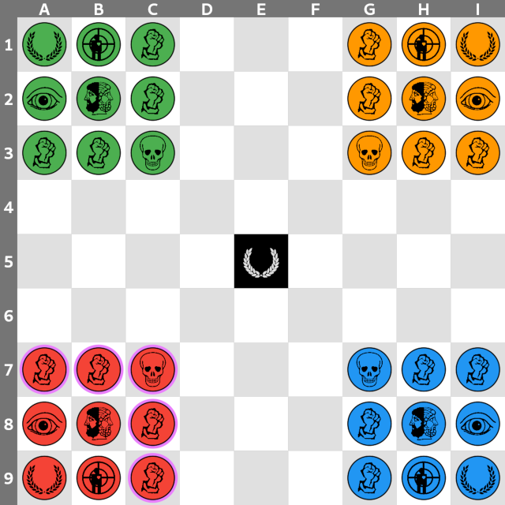
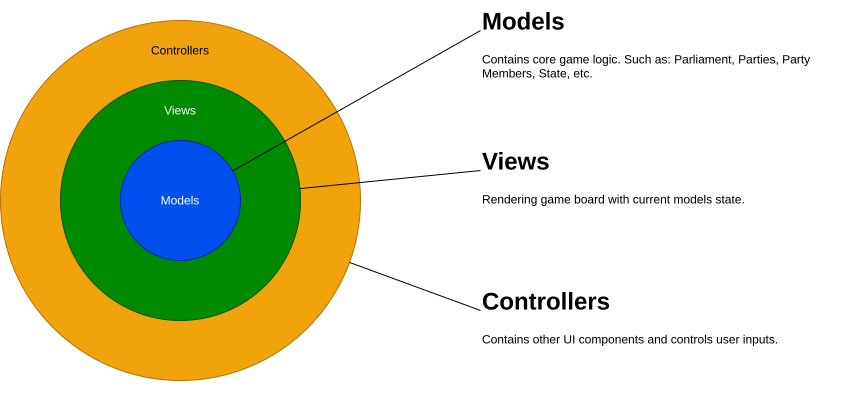

# Djambi

[](LICENSE)
[](#)
[](#)
<sup>powered by</sup>
[](https://flame-engine.org)
[](https://flutter.dev/)


**Djambi** is a strategic board game for four players designed by *Jean Anesto* in 1975.
Unlike chess, all four factions share the same 9×9 board simultaneously.
Pieces represent political roles — Chief, Assassin, Reporter, Diplomat, Necromobile,
and Militants — each with unique movement and abilities.
The goal is to occupy the central cell (the *Maze*) with your Chief and eliminate all rival Chiefs.

For background and complete history, see the [Wikipedia article](https://en.wikipedia.org/wiki/Djambi).

<sup>AVAILABLE ON</sup>
[](https://play.google.com/store/apps/details?id=com.datonomi.djambi)
[](https://mabdelaal86.github.io/djambi/)





## Features

- ♟️ Full Djambi rules on a 9×9 board with four factions (Red, Blue, Yellow, Green)
- 🤖 AI opponent with three difficulty levels — Easy, Medium, and Hard
- ↩️ Undo / ↪️ Redo — take back or replay moves at any time
- 📱 Fully responsive layout — portrait and landscape on phones, tablets, and desktops
- 📖 Built-in rules reference and piece guide with strategic tips
- ⚙️ Configurable: turn direction, starting faction, human/AI assignment per faction, game speed
- 🎨 Board notation visibility (none / top-left only / full)
- ✨ Move-flash animations to highlight the last-placed piece


## How to Play

### Objective
Occupy the **Maze** (center square E5) with your Chief *and* be the last faction with a living Chief.

### Turn Order
1. **Select** one of your highlighted pieces.
2. **Move** it to a valid destination (highlighted squares).
3. **Resolve** any secondary action your piece triggers (place a body, kill an adjacent enemy, etc.).
4. Play passes to the next faction (or the faction in power gets an extra turn first).

### Pieces (quick reference)

| Piece | Count | Special ability |
|---|---|---|
| **Chief** 👑 | 1 | Queen-like movement; occupying the Maze grants an extra turn per round |
| **Assassin** 🗡️ | 1 | Must land on an active enemy; kills instantly |
| **Reporter** 📰 | 1 | Moves to any empty square; may kill an adjacent enemy after moving |
| **Diplomat** 🤝 | 1 | Moves an enemy piece to a chosen square without killing it |
| **Necromobile** 💀 | 1 | Moves a dead body to any empty non-Maze square |
| **Militant** ⚔️ | 4 | Short range (≤2 squares); kills on contact |

See **[docs/PIECES.md](docs/PIECES.md)** for the full piece reference with images, movement rules, and strategy tips.

See the in-app **Rules & Pieces** screen for full rules, edge cases, and strategy tips.


## Getting Started

### Prerequisites

- [Flutter SDK](https://flutter.dev/docs/get-started/install) ≥ 3.11
- Dart SDK ≥ 3.11 (bundled with Flutter)

### Build & Run

```bash
cd flutter
flutter pub get
flutter run
```

To target a specific platform:

```bash
flutter run -d android   # Android device / emulator
flutter run -d ios       # iOS device / simulator (macOS only)
flutter run -d chrome    # Web
flutter run -d linux     # Linux desktop
flutter run -d windows   # Windows desktop
flutter run -d macos     # macOS desktop
```

### Release build (Android)

```bash
flutter build apk --release
# or for an app bundle:
flutter build appbundle --release
```


## Architecture

Source code lives in [`flutter/lib`](flutter/lib):

```
lib/
├── main.dart                 # App entry point & routing
├── models/                   # Pure game logic (no UI)
│   ├── parliament.dart       # Board state, turn management
│   ├── contest.dart          # Undo/redo stack + AI dispatch
│   ├── member.dart           # Base piece class
│   ├── members/              # Per-role movement & action logic
│   │   ├── chief.dart
│   │   ├── assassin.dart
│   │   ├── reporter.dart
│   │   ├── diplomat.dart
│   │   ├── necromobile.dart
│   │   └── militant.dart
│   ├── party.dart            # Faction helpers (active members, surrounded check)
│   ├── cell.dart             # Coordinate type + direction constants
│   ├── enums.dart            # Ideology, Role, Manoeuvre, PlayerType, …
│   ├── state.dart            # Snapshot (parliament + last-moved cells)
│   └── ai/
│       ├── tree.dart         # MaxN tree search + AiDifficulty enum
│       └── evaluation.dart   # Board evaluation heuristics
├── controllers/
│   ├── game.dart             # Flame game class (resize, AI timer, dialogs)
│   ├── preferences.dart      # SharedPreferences wrapper + ChangeNotifier
│   └── serialization.dart    # JSON file save/load helpers
├── views/                    # Flame components
│   ├── playground.dart       # Root layout (portrait / landscape)
│   ├── board.dart            # Board container
│   ├── player_panel.dart     # Per-faction status panel
│   ├── dimensions.dart       # Layout constants
│   ├── theme.dart            # BoardStyle, PieceTheme, NotationVisibility
│   ├── styles.dart           # Theme factory
│   ├── utils.dart            # Canvas helpers, SVG loader
│   └── renderers/
│       ├── grid.dart         # Cell backgrounds + maze
│       ├── margins.dart      # Notation labels
│       ├── movements.dart    # Highlights, tap handling, flash animations
│       └── pieces.dart       # Piece sprites
└── screens/                  # Flutter widget screens
    ├── home.dart
    ├── options.dart
    ├── settings.dart
    ├── rules.dart            # In-app rules reference
    ├── about.dart
    └── play.dart
```




## Known Issues

- When a Chief leaves the Maze, its team still gets an extra turn.
- When no player can win, the game does not detect the stalemate.


## Roadmap

- [x] Simple AI algorithm (MaxN tree search)
- [x] Undo / redo last move
- [x] Show next player indicator
- [x] Complete GUI — Home, Options, Settings, About screens
- [x] Detailed rules & piece description page
- [x] Application icon
- [x] Improved UI graphics and responsive layout (portrait + landscape)
- [x] Improved AI — strategic heuristics and three difficulty levels
- [x] Move-flash animations
- [x] Save / restore game state between sessions
- [x] Two-player local variation (hot-seat)
- [x] Sound effects
- [x] Animated piece movement (smooth tween across the board)


## License

This project is licensed under [GPL-3.0](https://www.gnu.org/licenses/gpl-3.0.html).


## Disclaimer & Credits

- This game is a **fan-made**, **non-commercial** recreation of Djambi,
  a public-domain board game designed by *Jean Anesto* in 1975.
- This project is **not officially affiliated** with *Jean Anesto*, his heirs,
  or any company that may have published Djambi historically.
- All **original game rules** are used under the principle that game mechanics are not copyrightable.
  Any **original artwork, branding, or terminology** from the 1975 version remains the property
  of its respective rights holders.
- This adaptation is open-source and free to use/distribute for non-commercial purposes.
- Piece images are based on the Djambi classic theme created by
  [Rsalen](https://commons.wikimedia.org/wiki/User:Rsalen).
- If you represent the rights to *Djambi* and have concerns, please
  [contact me](mailto:hello@datonomi.com) for respectful resolution.
