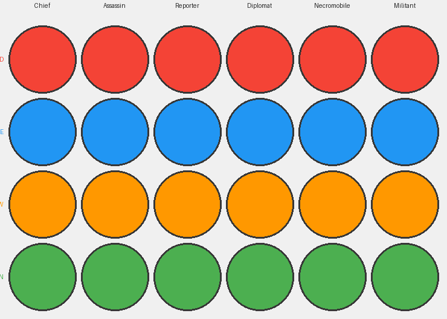
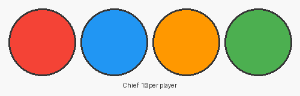
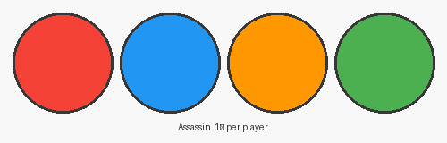
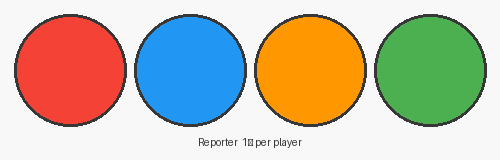
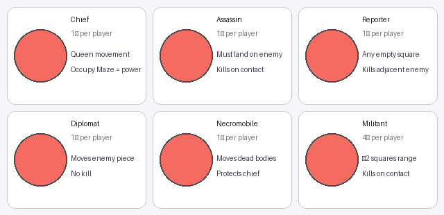

# Djambi — Piece Quick Reference

Each faction starts with **9 pieces**: 1 Chief, 1 Assassin, 1 Reporter, 1 Diplomat,
1 Necromobile, and 4 Militants.

---

## All Pieces at a Glance



*Rows: Red · Blue · Yellow · Green — Columns: Chief · Assassin · Reporter · Diplomat · Necromobile · Militant*

---

## Piece Reference

### 👑 Chief — 1 per faction



| Property | Detail |
|---|---|
| **Movement** | Any number of squares in any of 8 directions (like a chess Queen) |
| **On contact** | Kills the occupant; moves the body to any empty non-Maze square |
| **Special** | Occupying the **Maze** (center square) grants an extra turn every round |
| **Elimination** | If surrounded on all sides by enemies (flood-fill), the Chief is eliminated without direct attack |

> **Strategy**: Your Chief is your most powerful and most vulnerable piece.
> Rush it toward the Maze for tempo, but keep Militants nearby for defense.

---

### 🗡️ Assassin — 1 per faction



| Property | Detail |
|---|---|
| **Movement** | Any number of squares in any of 8 directions — **must land on an active enemy** |
| **On contact** | Kills the target instantly |
| **Body placement** | If the killed piece was **in the Maze**, body is returned to the Assassin's origin cell; otherwise it stays |
| **Restriction** | Cannot move to empty squares |

> **Strategy**: The Assassin is your long-range sniper. Use it to threaten enemy
> Chiefs from across the board. Keep it safe — it can't retreat to empty space.

---

### 📰 Reporter — 1 per faction



| Property | Detail |
|---|---|
| **Movement** | Any empty non-Maze square on the board (unlimited range) |
| **After moving** | **May** kill one orthogonally adjacent active enemy; the body stays in place |
| **Restriction** | Cannot move to occupied squares; cannot enter the Maze |

> **Strategy**: The Reporter's free movement makes it great for area control.
> Park it next to clusters of enemies; it can kill one each turn without moving.

---

### 🤝 Diplomat — 1 per faction


| Property | Detail |
|---|---|
| **Movement** | Any number of squares in any of 8 directions, landing on an active enemy |
| **On contact** | **Does NOT kill** — relocates the target to any empty square |
| **Special placement** | Can move a Chief **into the Maze**; no other piece can do this to a Chief |
| **Body placement** | If the moved piece was in the Maze, a kill action follows |

> **Strategy**: Use the Diplomat to eject an enemy Chief from the Maze, or to
> move your own pieces out of danger. It's the only piece that can forcibly
> place a Chief into the Maze.

---

### 💀 Necromobile — 1 per faction


| Property | Detail |
|---|---|
| **Movement** | Any number of squares in any of 8 directions, landing on a **dead body** |
| **On contact** | Moves the dead body to any empty non-Maze square |
| **Special** | While your Necromobile is active, your Chief **cannot be surrounded** |

> **Strategy**: Dead body placement is a strategic tool — block enemy paths,
> protect your Chief's escape routes, or clear space for your pieces.
> The surrounding protection alone makes the Necromobile invaluable.

---

### ⚔️ Militant — 4 per faction


| Property | Detail |
|---|---|
| **Movement** | Up to **2 squares** in any of 8 directions |
| **On contact** | Kills the target; moves the body to any empty non-Maze square |
| **Restriction** | Cannot enter the Maze; cannot jump over pieces |

> **Strategy**: Militants are your workhorses — use them to form a defensive wall
> around your Chief, clear the path to the Maze, or control key squares near
> the center.

---

## Quick Reference Card



---

## Turn Summary

```
1. Select one of your highlighted pieces
2. Move it to a valid destination (highlighted squares)
3. Resolve any secondary action:
     Reporter → optionally kill an adjacent enemy
     Diplomat → choose where to relocate the target
     Chief/Militant/Assassin/Necromobile → choose where to place the body
4. Turn passes to the next faction
        (party in Maze gets an extra turn first)
```

---

## Win Condition

Occupy the **Maze** (center square E5) with your Chief
**and** be the last faction with a living Chief.

---

*See [README.md](../README.md) for full rules, architecture, and build instructions.*
